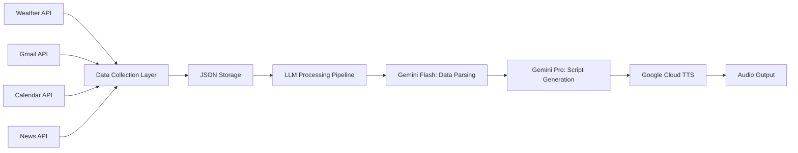

# 🌅 Morning Brief: AI-Powered Personal Assistant

[](https://python.org)
[](LICENSE)
[](https://black.readthedocs.io/)

An intelligent, automated morning briefing system that aggregates personalized data from multiple sources and generates a comprehensive daily summary using advanced Large Language Models (LLMs). This project demonstrates expertise in AI integration, API orchestration, cloud services, and professional software development practices.

## 🎯 Project Overview

The Morning Brief system creates a personalized daily audio briefing by:
- **Collecting** real-time data from multiple APIs (Weather, News, Gmail, Google Calendar)
- **Processing** raw data through a multi-tiered LLM pipeline
- **Generating** coherent, conversational summaries using Google's Gemini AI
- **Converting** text to natural speech using Google Cloud Text-to-Speech

## 🏗️ Architecture & Data Flow



### Data Pipeline Stages

1. **Raw Data Collection** → Structured JSON storage
2. **Mid-tier LLM Processing** → Context-aware summaries  
3. **High-tier LLM Aggregation** → Conversational script generation
4. **Audio Synthesis** → Natural speech output

## 🔧 Technical Implementation

### Key Challenges Solved

#### 1. **OAuth 2.0 Authentication Management**
- Implemented robust token refresh mechanisms for Gmail and Calendar APIs
- Built error handling for expired credentials with automatic re-authentication
- Secure credential storage with environment variable configuration

#### 2. **Multi-API Data Orchestration**
- Designed modular data collection system with standardized JSON output
- Implemented rate limiting and error handling for external API calls
- Created configuration management system for API keys and settings

#### 3. **LLM Pipeline Optimization**
- **Tier 1**: Gemini Flash models for efficient data parsing and summarization
- **Tier 2**: Gemini Pro for sophisticated script generation and narrative flow
- Context-aware prompt engineering for consistent, high-quality outputs

#### 4. **Professional Package Structure**
- Modular design with clear separation of concerns
- Type hints and comprehensive documentation
- Package installation support with `setup.py`
- Proper import management and namespace organization

## 📁 Project Structure

```
Morning_Brief/
├── 📄 README.md                          # Project documentation
├── 📄 setup.py                           # Package installation configuration
├── 📄 collect_data.py                    # Main data collection orchestrator
├── 📄 generate_script.py                 # LLM processing and script generation
├── 📄 text_to_speech.py                  # Audio synthesis entry point
├── 📁 src/                               # Core source code
│   ├── 📁 weather/                       # Weather data integration
│   │   ├── 📄 __init__.py
│   │   └── 📄 weather.py                 # OpenWeatherMap API integration
│   ├── 📁 news/                          # News aggregation
│   │   ├── 📄 __init__.py
│   │   └── 📄 news.py                    # Guardian API integration
│   ├── 📁 email_retrieve/                # Gmail integration
│   │   ├── 📄 __init__.py
│   │   ├── 📄 email_collection.py        # Gmail API with OAuth 2.0
│   │   └── 📄 oauth_credentials.json     # Google Cloud credentials
│   ├── 📁 calendar_retrieve/             # Google Calendar integration
│   │   ├── 📄 __init__.py
│   │   ├── 📄 calendar_collection.py     # Calendar API with OAuth 2.0
│   │   └── 📄 oauth_credentials.json     # Google Cloud credentials
│   ├── 📁 stocks/                        # Financial data (Alpha Vantage)
│   │   ├── 📄 __init__.py
│   │   └── 📄 stocks.py
│   ├── 📁 processing/                    # LLM processing layer
│   │   ├── 📄 __init__.py
│   │   ├── 📄 gen_ai.py                  # Gemini AI integration
│   │   ├── 📄 ollama_querying_local.py   # Local LLM support (Ollama)
│   │   └── 📄 line_creation.py           # Script formatting utilities
│   ├── 📁 output/                        # Audio generation
│   │   └── 📄 tts.py                     # Google Cloud Text-to-Speech
│   └── 📁 utils/                         # Configuration management
│       └── 📄 config.py                  # Environment variables & API keys
├── 📁 data/                              # Structured data storage
│   ├── 📄 weather_data.json
│   ├── 📄 news_headlines.json
│   ├── 📄 primary_emails.json
│   └── 📄 full_calendars.json
├── 📁 scripts/                           # Generated outputs
│   └── 📄 main_script.txt                # Generated morning brief script
├── 📁 output/                            # Audio files
│   └── 📁 audio/
│       └── 📄 voice_output.mp3           # Final audio briefing
├── 📁 config/                            # Configuration files
│   └── 📄 default.json                   # Application settings
├── 📁 notebooks/                         # Research & experimentation
│   ├── 📄 gen_ai.ipynb                   # LLM testing and optimization
│   ├── 📄 news_testing.ipynb             # News API experimentation
│   └── 📄 weather_data_testing.ipynb     # Weather data analysis
├── 📁 docs/                              # Technical documentation
│   ├── 📄 country_codes_ISO_3166-1.md
│   ├── 📄 google_cloud_tts_voices.md
│   └── 📄 ollama_api_access.md
└── 📁 tests/                             # Unit tests (planned)
```

## 🚀 Getting Started

### Prerequisites

- Python 3.13+
- Google Cloud Project with enabled APIs:
  - Gmail API
  - Google Calendar API
  - Google Cloud Text-to-Speech API
- API Keys for:
  - OpenWeatherMap
  - The Guardian
  - Google Gemini AI
  - Alpha Vantage (stocks)

### Installation

1. **Clone the repository:**
   ```bash
   git clone https://github.com/yourusername/morning-brief.git
   cd morning-brief
   ```

2. **Install the package in development mode:**
   ```bash
   pip install -e .
   ```

3. **Install required dependencies:**
   ```bash
   pip install google-auth google-auth-oauthlib google-auth-httplib2 google-api-python-client requests
   ```

4. **Configure environment variables:**
   - Set up API keys in `src/utils/config.py`
   - Place Google OAuth credentials in appropriate directories
   - Configure `config/default.json` with your preferences

### Usage

1. **Collect Data:**
   ```bash
   python collect_data.py
   ```

2. **Generate Script:**
   ```bash
   python generate_script.py
   ```

3. **Create Audio Briefing:**
   ```bash
   python text_to_speech.py
   ```

## 🔑 Key Features

### 🤖 **Advanced AI Integration**
- **Multi-model LLM pipeline** using Google's Gemini Flash and Pro models
- **Context-aware prompt engineering** for consistent, high-quality outputs
- **Local LLM support** with Ollama integration for development/testing

### 🔗 **Robust API Management**
- **OAuth 2.0 authentication** with automatic token refresh
- **Rate limiting and error handling** for external API calls
- **Modular data collection** with standardized JSON interfaces

### ☁️ **Google Cloud Integration**
- **Gmail API** for intelligent email summarization
- **Google Calendar API** for schedule management
- **Google Cloud Text-to-Speech** for natural audio generation
- **Gemini AI models** for advanced text processing

### 🛠️ **Professional Development Practices**
- **Package-based architecture** with proper namespace management
- **Type hints and documentation** for maintainable code
- **Modular design** with clear separation of concerns
- **Version control best practices** with comprehensive `.gitignore`

## 🎯 Skills Demonstrated

- **Large Language Model Integration** (Gemini, Ollama)
- **Google Cloud Platform Services** (Gmail, Calendar, TTS, AI)
- **OAuth 2.0 Authentication Flows**
- **RESTful API Integration** (Weather, News, Financial)
- **Python Package Development** 
- **Professional Project Architecture**
- **Version Control & Documentation**
- **Data Pipeline Design**
- **Error Handling & Resilience**

## 📈 Future Enhancements

- [ ] **Containerization** with Docker for deployment
- [ ] **CI/CD Pipeline** with GitHub Actions
- [ ] **Unit Testing** with pytest
- [ ] **Web Interface** for configuration and monitoring
- [ ] **Database Integration** for historical data analysis
- [ ] **Custom Voice Training** for personalized TTS
- [ ] **Mobile App Integration** for on-the-go briefings

## 📝 License

This project is licensed under the MIT License - see the [LICENSE](LICENSE) file for details.

## 🤝 Contributing

Contributions are welcome! Please feel free to submit a Pull Request.

---

**Built with ❤️ using Python, Google Cloud, and AI**