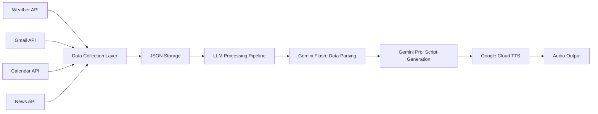

# 🌅 Morning Brief: AI-Powered Personal Assistant

An intelligent, automated morning briefing system that aggregates personalized data from multiple sources and generates a comprehensive daily summary using Large Language Models (LLMs). This summary can be read aloud to you in the morning to prepare you for the day.

This is an ongoing project, and **suitable** contributions are welcome.

I aim to incorporate RAG functionality to expand the feature set to include tracking of more diverse, unstructured personal information stores in json, pdf, csv files, which can all be modularly included in daily AI briefings.

I work on this project periodically. 

## 🎯 Project Overview

The system creates a personalized daily audio briefing by:
- **Collecting** real-time data from multiple APIs (Weather, News, Gmail, Google Calendar), stored in json
- **Processing** raw data through a multi-tiered LLM pipeline, integrated with locally run deepseek R1 model/ Gemini Flash (reduce cloud computation costs)
- **Generating** coherent, conversational summaries using Google's Gemini AI, script generation with adjustable prompts to customize different aspects of data reporting (with Gemini Pro)
- **Converting** text to natural speech using Google Cloud Text-to-Speech

## 🏗️ Architecture & Data Flow



## 🔧 Technical Implementation

#### - **OAuth 2.0 Authentication for GC integration**
#### - **Multi-API Data Orchestration**
- Designed modular data collection system with standardized JSON output
- Created configuration management system for API keys and settings

#### - **Professional Package Structure**
- Modular design with clear separation of concerns
- Proper import management and namespace organization
- Testing code integrated with scripts
- **Version control best practices** with comprehensive `.gitignore` and commit history


#### - **Config File**
- Future ease of customizability, cross-file coordination

### ☁️ **Google Cloud Integration**
- **Gmail API** for intelligent email summarization
- **Google Calendar API** for schedule management
- **Google Cloud Text-to-Speech** for natural audio generation
- **Gemini AI models** for advanced text processing

## 📁 Project Structure

```
Morning_Brief/
├── 📄 README.md                          # Project documentation
├── 📄 setup.py                           # Package installation configuration
├── 📄 collect_data.py                    # Main data collection orchestrator
├── 📄 generate_script.py                 # LLM processing and script generation
├── 📄 text_to_speech.py                  # Audio synthesis entry point
├── 📁 src/                               # Core source code
│   ├── 📁 weather/                       # Weather data integration
│   │   ├── 📄 __init__.py
│   │   └── 📄 weather.py                 # OpenWeatherMap API integration
│   ├── 📁 news/                          # News aggregation
│   │   ├── 📄 __init__.py
│   │   └── 📄 news.py                    # Guardian API integration
│   ├── 📁 email_retrieve/                # Gmail integration
│   │   ├── 📄 __init__.py
│   │   ├── 📄 email_collection.py        # Gmail API with OAuth 2.0
│   │   └── 📄 oauth_credentials.json     # Google Cloud credentials
│   ├── 📁 calendar_retrieve/             # Google Calendar integration
│   │   ├── 📄 __init__.py
│   │   ├── 📄 calendar_collection.py     # Calendar API with OAuth 2.0
│   │   └── 📄 oauth_credentials.json     # Google Cloud credentials
│   ├── 📁 stocks/                        # Financial data (Alpha Vantage)
│   │   ├── 📄 __init__.py
│   │   └── 📄 stocks.py
│   ├── 📁 processing/                    # LLM processing layer
│   │   ├── 📄 __init__.py
│   │   ├── 📄 gen_ai.py                  # Gemini AI integration
│   │   ├── 📄 ollama_querying_local.py   # Local LLM support (Ollama)
│   │   └── 📄 line_creation.py           # Script formatting utilities
│   ├── 📁 output/                        # Audio generation
│   │   └── 📄 tts.py                     # Google Cloud Text-to-Speech
│   └── 📁 utils/                         # Configuration management
│       └── 📄 config.py                  # Environment variables & API keys
├── 📁 data/                              # Structured data storage
│   ├── 📄 weather_data.json
│   ├── 📄 news_headlines.json
│   ├── 📄 primary_emails.json
│   └── 📄 full_calendars.json
├── 📁 scripts/                           # Generated outputs
│   └── 📄 main_script.txt                # Generated morning brief script
├── 📁 output/                            # Audio files
│   └── 📁 audio/
│       └── 📄 voice_output.mp3           # Final audio briefing
├── 📁 config/                            # Configuration files
│   └── 📄 default.json                   # Application settings
├── 📁 notebooks/                         # Research & experimentation
│   ├── 📄 gen_ai.ipynb                   # LLM testing and optimization
│   ├── 📄 news_testing.ipynb             # News API experimentation
│   └── 📄 weather_data_testing.ipynb     # Weather data analysis
├── 📁 docs/                              # Technical documentation
│   ├── 📄 country_codes_ISO_3166-1.md
│   ├── 📄 google_cloud_tts_voices.md
│   └── 📄 ollama_api_access.md
└── 📁 tests/                             # Unit tests (planned)
```

## 🚀 Getting Started

### Prerequisites

- Python 3.13+
- Google Cloud Project with enabled APIs:
  - Gmail API
  - Google Calendar API
  - Google Cloud Text-to-Speech API
- API Keys for:
  - OpenWeatherMap
  - The Guardian
  - Google Gemini AI
  - Alpha Vantage (stocks)

### Usage

1. **Collect Data:**
   ```bash
   python collect_data.py
   ```

2. **Generate Script:**
   ```bash
   python generate_script.py
   ```

3. **Create Audio Briefing:**
   ```bash
   python text_to_speech.py
   ```

## 📈 Future Enhancements

- [ ] **Containerization** with Docker for deployment
- [ ] **CI/CD Pipeline** with GitHub Actions
- [ ] **Unit Testing** with pytest
- [ ] **Web Interface** for configuration and monitoring
- [ ] **Database Integration** for historical data analysis
- [ ] **Custom Voice Training** for personalized TTS
- [ ] **Mobile App Integration** for on-the-go briefings

## 📝 License

This project is licensed under the MIT License - see the [LICENSE](LICENSE) file for details.